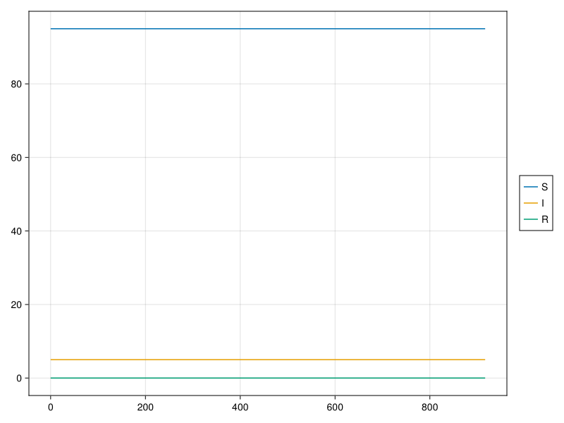
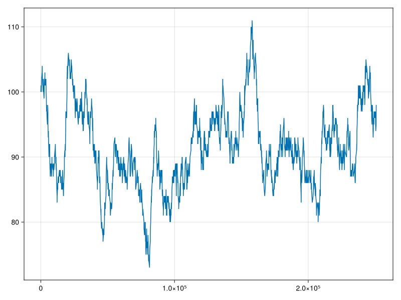

# Petri Nets and Graph Rewriting

It's a good idea to be able to formalize the "token game" that occurs on a marked Petri Net (henceforth, PN). This was first considered by [Kreowski (1981)](https://doi.org/10.1007/3-540-10291-4_22), but his graphs had the relations in an inconvenient direction (edges from places to tokens). [Genrich et al. (1983)](https://doi.org/10.1007/BFb0000102) fixed this. The reason is that the first way is not a function, we need to introduce another set in order to handle the one-to-many relationship (assuming we are working in **Set**), yet the second is a functional relation (a token tells you which place it belongs to).

What is the point of this exercise? The point is to demonstrate how to simulate "agent-based" dynamics occuring on a Petri net, in continuous time, with non-Exponential distributions. I do not think that Petri nets expressed in a categorical representation (the SITOS net of Kock), graph rewriting based dynamics, and non-Markovian clocks have been combined before, at least not in a way that involves relatively little fuss on behalf of the user, relying on open-source packages which are not aware of each others' existence. I would like to eventually examine what we've done here in more detail and connect it to recent work on non-Markovian stochastic Petri nets, basically seeing what from [Salvatore et al. (2017)](https://doi.org/10.1016/j.peva.2017.03.001) remains to be explored. Such advances could seriously benefit a wide class of models (ecology, biology, manufacturing, logistics, circuit design, telecommunications, etc), and as more modeling frameworks (queueing networks come to mind) become categorified, bridge conceptual gaps between different approaches.

# SIRS with demography

The specific model I chose for this exercise is a SIRS model with demography. Elaborations of this style of model are often used to model childhood diseases (kids get sick, have some immunity for a while, before becoming susceptible again; there is also birth/immigration and death/emigration). It looks like this:

Before going on, here is the schema I am using to represent our Petri nets (`SchMarkedLabelledPetriNet`). [Genrich et al. (1983)](https://doi.org/10.1007/BFb0000102) proposed something similar, although expressed in set theory, and instead of 4 sets, only had 2, and a relation for the input and output arcs. The set of tokens and mapping from tokens to places is however, what they proposed.

A function `make_rule` makes a DPO rewrite rule for each transition.

Next there is a schema to describe the "clock system". The clock system serves to simulate stochastic dynamics of a system whose enabling rules and state update rules are given by a set of rewriting rules. It should be able to handle any type of random delay distribution, from Dirac delta being the "least Markovian" and Exponential being "most Markovian", if we imagine classifying history dependency by shape of its hazard function; a Dirac is an infinitely high spike and an Exponential will have a flat line. These systems and various algorithms for sampling them are described in [Dolgert (2016)](https://arxiv.org/abs/1610.03939), and we use a package inspired by that work to do the sampling.

What is the job of the clock system (schema below)? Let's call each rewriting rule an "Event" in the system (so event has an attribute RuleType). Each match of the rule into the current world state corresponds to an "enabled clock"; this means that this specific Clock may occur in the future unless something else happens first such that it becomes disabled. Each clock knows what event enabled it. When a clock becomes newly enabled, it draws a random completion time from the distribution for waiting times associated with that event (DistType). We store the hom-set of matches for each event in MatchType. After anything happens, we need to see what clocks were newly disabled (matches that are removed from the hom-set) and get rid of them. Clocks that are persistent (were enabled before and after the state change) are not modified (at least in the simple models we consider here). Clocks that are newly enabled draw a waiting time and are added to the set of clocks.

We use [https://github.com/adolgert/Fleck.jl](https://github.com/adolgert/Fleck.jl) to do the sampling, that is why the clocks in the schema do not have an attribute for floating point completion times, and instead have a key; when a clock is enabled, we add it's key to the sampler from Fleck. When one is disabled, we remove it via its key. Fleck has a large number of sampling algorithms, suitable for different purposes and different shapes of probability distributions. Currently documentation is lacking, but it follows the design principles from the older C++ library [Semi-Markov](http://afidd.github.io/).

There is a big ugly function I coded up very quickly called `run_sirs`. It defines the SIRS Petri net with an intial marking, builds a clock system, assigns probability distribution functions to each event (note that we give the I to R transition a Weibull distribution, people might think we are cheating if we use an "easy" to sample distribution like a Gamma, so that's why we use a hard one). We then set up Fleck's sampler. We use as clock keys a tuple of `Int`s. The first tells us what event the clock came from, the other two come from the hom-set for each event. Then, all the clocks/matches are uniquely identifiable by key. The second type parameter for the sampler `Float64` tells it that we are using that type for any variables storing points in time.

The actual simulation loop is simple. We ask Fleck when is the next event time and which one was it (`next`). We then apply the rewrite rule to update state, and grab the maps generated during its application. There is a slight complication for "always enabled" transitions (i.e. `L` in their rule does not reference "mutable" state, that is, tokens). In this model it's the birth/immigration transition. The hom-set won't change, but if it fires we need to throw out that clock waiting time (which was just consumed), and draw another one. Then we update the hom-set for all events, adding newly enabled clocks (newly found matches) to the sampler, and disabling clocks for matches which are removed from the hom-set.

When we simulate in a certain parameter range, we get the oscillatory dynamics that SIRS style models are known for:

If the initial marking contains only `S` individuals, we get the classic [birth-death process](https://en.wikipedia.org/wiki/Birth%E2%80%93death_process) (I set up the parameters such that the total population should remain at its equilibrium distribution). 

The resulting simulation is a bit slow (even considering these population sizes are very very small), but the proof of concept is there.

You may note that the `Clock` object in the schema actually doesn't do anything yet. I am thinking about closer integration with Fleck, so kept it around. Also it's nice conceptually to see.

# Notes

  * after Fleck is registered, move the dep to the one in the general repo (from `https://github.com/adolgert/Fleck.jl`)
  * after https://github.com/AlgebraicJulia/AlgebraicRewriting.jl/pull/43 is merged, go back to depending on main (`https://github.com/AlgebraicJulia/AlgebraicRewriting.jl#attr_incremental`)

# References

  1. Kreowski, HJ. (1981). A comparison between petri-nets and graph grammars. In: Noltemeier, H. (eds) Graph theoretic Concepts in Computer Science. WG 1980. Lecture Notes in Computer Science, vol 100. Springer, Berlin, Heidelberg. https://doi.org/10.1007/3-540-10291-4_22
  2. Genrich, H.J., Janssens, D., Rozenberg, G., Thiagarajan, P.S. (1983). Petri nets and their relation to graph grammars. In: Ehrig, H., Nagl, M., Rozenberg, G. (eds) Graph-Grammars and Their Application to Computer Science. Graph Grammars 1982. Lecture Notes in Computer Science, vol 153. Springer, Berlin, Heidelberg. https://doi.org/10.1007/BFb0000102
  3. Distefano, Salvatore, Francesco Longo, and Marco Scarpa. "Marking dependency in non-Markovian stochastic Petri nets." Performance Evaluation 110 (2017): 22-47. https://doi.org/10.1016/j.peva.2017.03.001
  4. Dolgert, Andrew J. "Continuous-Time, Discrete-Event Simulation from Counting Processes." arXiv preprint arXiv:1610.03939 (2016). https://arxiv.org/abs/1610.03939